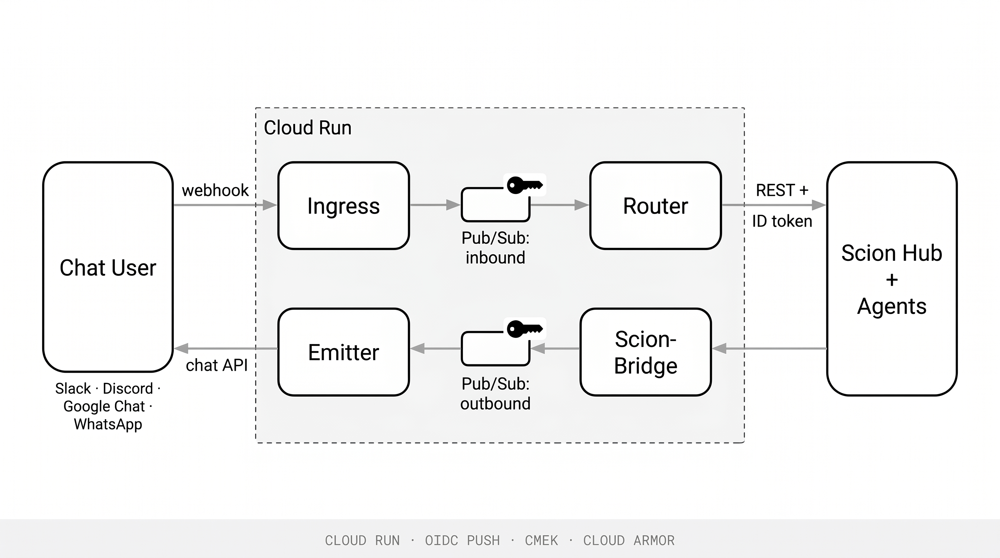
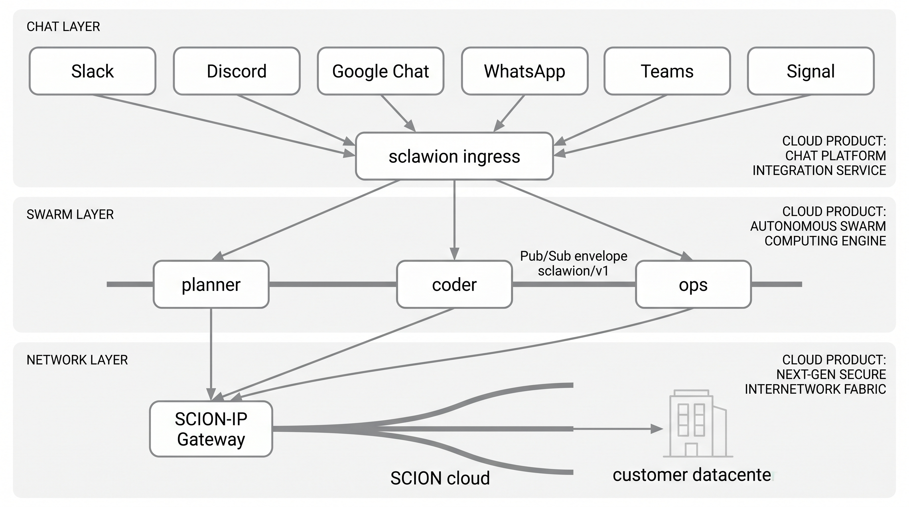
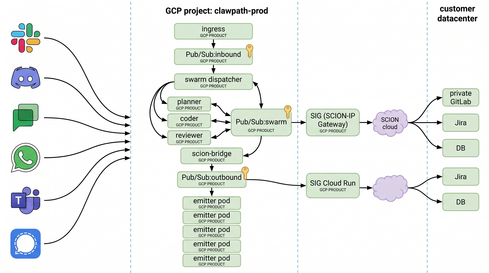

# sclawion

> Async chat ↔ agent bridge for [Scion](https://github.com/GoogleCloudPlatform/scion).
> Talk to a GCP multi-agent fleet from Slack, Discord, Google Chat, or WhatsApp.

[](LICENSE)
[](docs/ROADMAP.md)
[](docs/GCP_PATTERNS.md)
[](go.mod)

`sclawion` is the missing async surface for [Scion](https://github.com/GoogleCloudPlatform/scion):
a stateless, GCP-native bridge that puts every chat platform on the same wire
— **GCP Pub/Sub** — so a Scion agent fleet can be addressed as if it were a
teammate sitting in your channel.



## At a glance

The bridge sits between three layers — chat surfaces on top, the agent swarm in
the middle, and (in the enterprise [CLAWPATH](docs/CLAWPATH.md) tier) a
SCION-routed network underlay reaching into customer infrastructure on the
bottom. The Pub/Sub envelope is the single contract between them.



End-to-end, the same diagram with concrete GCP services and topic flow:



> Both figures show the **CLAWPATH** enterprise tier (chat + swarm + SCION
> network underlay). The base `sclawion` project is just the top two layers —
> chat → ingress → Pub/Sub → router → Scion Hub → bridge → emitters → chat.
> The SCION underlay is opt-in for customers who need agents to reach inside
> private networks without BGP / VPN sprawl. See [`CLAWPATH.md`](docs/CLAWPATH.md)
> and [`clawpath/SCION.md`](docs/clawpath/SCION.md) for the full story.

## Why this exists

Scion's Hub gives you a REST API to dispatch agents and a WebSocket to tail
logs — and that's it. There's no event bus, no webhook spec, no chat
integration. Every team that wants ChatOps over Scion has to write the same
glue. `sclawion` is that glue, done once, with a security and reliability
posture that holds up under enterprise review.

## What you get

- **One bus, four chat platforms.** Slack, Discord, Google Chat, WhatsApp — all
  normalize to a single CloudEvents-shaped envelope (`pkg/event`).
- **Stateless services.** Cloud Run, scale-to-zero, no VMs to patch. State
  lives in Firestore (correlation, idempotency) and Secret Manager (creds).
- **Bidirectional.** Users mention the bot → agent spawned. Agent emits
  updates → posted back into the originating thread.
- **Enterprise security baseline.** CMEK on Pub/Sub + Firestore, Workload
  Identity (no JSON keys), constant-time HMAC, Cloud Armor at the edge,
  VPC-SC perimeter, Binary Authorization on container images. See
  [`docs/SECURITY.md`](docs/SECURITY.md).
- **Reliability primitives.** OIDC push, dead-letter topics, ordering keys,
  Firestore-backed idempotency. See [`docs/OPERATIONS.md`](docs/OPERATIONS.md).

## Documentation

| Doc | What's in it |
|-----|--------------|
| [`CLAUDE.md`](CLAUDE.md) | Load-bearing context for any contributor (human or agent). Read first. |
| [`docs/ARCHITECTURE.md`](docs/ARCHITECTURE.md) | Components, sequence diagrams, design tradeoffs, exit ramps. |
| [`docs/SECURITY.md`](docs/SECURITY.md) | Threat model, controls, compliance posture. |
| [`docs/OPERATIONS.md`](docs/OPERATIONS.md) | Deployment topology, SLOs, runbooks, incident response. |
| [`docs/EVENT_SCHEMA.md`](docs/EVENT_SCHEMA.md) | The normalized `Envelope` reference + versioning rules. |
| [`docs/CONNECTORS.md`](docs/CONNECTORS.md) | How to add a new chat platform end-to-end. |
| [`docs/GCP_PATTERNS.md`](docs/GCP_PATTERNS.md) | Why GCP-native primitives carry their weight here. |
| [`docs/CONTRIBUTING.md`](docs/CONTRIBUTING.md) | Dev setup, coding standards, PR process. |
| [`docs/ROADMAP.md`](docs/ROADMAP.md) | What's shipped, what's next. |
| [`examples/`](examples/) | Slack, WhatsApp onboarding walkthroughs. |

## Quickstart (local)

```bash
git clone https://github.com/jswortz/sclawion
cd sclawion
go mod tidy
go build ./...

# local emulators (TODO: deploy/compose.yaml)
docker compose -f deploy/compose.yaml up -d

# replay a signed Slack fixture against a local ingress
make smoke
```

## Quickstart (cloud, staging)

```bash
cd deploy/terraform
terraform init
terraform apply -var project_id=$PROJECT -var env=stage

# wire each platform's webhook URL to:
#   https://stage-ingress.<your-domain>/v1/{slack|discord|gchat|whatsapp}
# secrets pushed via:
echo -n "$SLACK_SIGNING_SECRET" | gcloud secrets versions add slack-signing-secret --data-file=-
```

Full per-platform setup in [`examples/`](examples/).

## Repo layout

```
cmd/                   four Cloud Run services (ingress, router, scion-bridge, emitter)
pkg/
  event/               normalized CloudEvent envelope (sclawion/v1)
  connectors/<p>/      Verifier + Decoder + Encoder per platform
  scion/               typed Scion Hub REST client
  correlation/         Firestore conversation ↔ agent store
  secrets/             Secret Manager wrapper
  auth/                HMAC, OIDC, replay-cache helpers
  pubsub/              publish/ack helpers
  obs/                 OpenTelemetry init
deploy/
  terraform/           all GCP infra
  cloudrun/            service manifests
skills/openclaw/       Scion skill so agents can self-publish
test/
  integration/         emulator-driven tests
  fixtures/            signed sample webhooks
docs/                  deep-dive documentation
examples/              per-platform onboarding guides
```

## Status

Pre-alpha scaffolding. APIs and schemas may break.
Roadmap and milestones in [`docs/ROADMAP.md`](docs/ROADMAP.md).

## License

[Apache 2.0](LICENSE) — matches Scion. Contributions welcome; see
[`docs/CONTRIBUTING.md`](docs/CONTRIBUTING.md).

## Acknowledgements

- [Scion](https://github.com/GoogleCloudPlatform/scion) — the orchestration
  platform `sclawion` makes conversational.
- [CloudEvents](https://cloudevents.io/) — the envelope shape we borrow.
