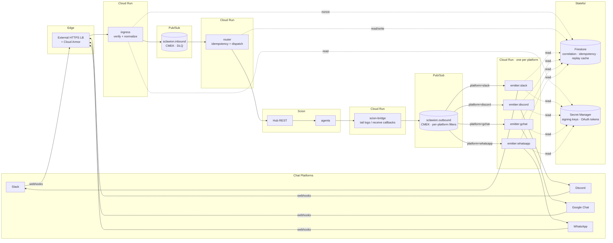
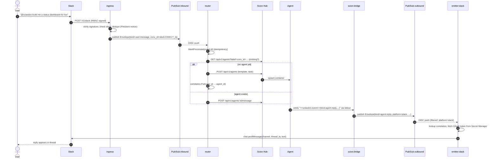

# Architecture

This document is the canonical reference for how `sclawion` is shaped, why it's
shaped that way, and where the seams are if you need to change it. If you're
new to the project, read this **after** [`CLAUDE.md`](../CLAUDE.md) and **before**
making non-trivial changes.

## Design goals (in priority order)

1. **Decouple chat platforms from Scion.** A Scion outage must not corrupt
   chat state; a Slack incident must not back-pressure agents. Pub/Sub is the
   firewall between them.
2. **Stateless services, scale to zero.** Cloud Run plus Pub/Sub-OIDC-push
   means no long-lived workers, no client SDKs in the data path, and no idle
   compute when no one is talking to a bot.
3. **Single normalized event shape.** Connectors are the only place
   platform-specific types are allowed. Everything past `cmd/ingress` speaks
   `event.Envelope`. Adding a fifth platform must not require touching the
   router.
4. **Enterprise security by default.** CMEK, Workload Identity, constant-time
   crypto, replay protection, signed images. Defaults are the secure path.
5. **Observable end-to-end.** OTEL spans propagate via `Envelope.Trace` so
   "user typed `@bot foo` 12s ago and got nothing back" is one Cloud Trace
   query, not five log searches.

## Component diagram

## End-to-end sequence: user → agent → user

## Why these specific components

### Pub/Sub as the only path between connectors and Scion

- **Backpressure isolation.** If Scion is slow, ingress acks Slack in <500 ms
  and messages queue up in `sclawion.inbound`; nothing times out at the
  webhook layer.
- **At-least-once semantics with explicit idempotency.** Pub/Sub's at-least-once
  delivery + Firestore `processed_events/{event_id}` doc gives you
  effectively-once without paying for a stream processor.
- **Per-platform fan-out for free.** Outbound subs filter on
  `attribute.platform=slack`; one topic, four readers, no per-platform topic
  proliferation.
- **Ordering keys per conversation** preserve "user said A then B" without
  blocking unrelated conversations.
- **DLQ + retry policy** are configuration, not code.

### Two topics, not one

`sclawion.inbound` and `sclawion.outbound` are deliberately separate so that
attribute filters on the outbound side can split per-platform without inbound
emitters reading every message. Combined with ordering keys, each conversation
sees a clean linear stream in each direction.

### Stateless services on Cloud Run

- Scale-to-zero between events; no idle cost.
- OIDC-pull into receivers means **no Pub/Sub client SDK** in the hot path —
  the receiver is just an HTTP handler validating a JWT.
- Generation-2 execution environment supports the larger filesystem and longer
  request deadlines we need for agent dispatch.
- Binary Authorization gates which images may run.

### Firestore for correlation, idempotency, and replay cache

- Single-document strong consistency removes the need for distributed locks.
- TTL on documents handles the replay cache automatically.
- IAM-scoped per service account; no shared connection pools to misconfigure.

### A separate `scion-bridge` instead of folding it into the router

The router is request-driven (one Pub/Sub push per inbound message). The
bridge is poll/subscribe-driven (it watches Scion for state changes).
Conflating them means coupling two unrelated lifecycles and complicating
scale-to-zero. Splitting them keeps each service single-purpose.

## Failure modes and what happens

| Failure                                          | Visible effect                                  | Mitigation                                                                 |
|--------------------------------------------------|-------------------------------------------------|----------------------------------------------------------------------------|
| Slack delivers same webhook twice                | Same envelope published twice to inbound        | Router's `MarkProcessed(event.id)` dedupes; second is a no-op             |
| Pub/Sub redelivers a message                     | Receiver sees it again                          | Receivers are idempotent; non-200 returns trigger backoff, then DLQ       |
| Scion Hub returns 5xx                            | Router retries via Pub/Sub backoff              | Receiver returns 5xx → push backoff escalates → DLQ after `max_attempts`  |
| Bot OAuth token expired                          | Emitter gets 401 from chat platform             | Secret rotation Cloud Function publishes `secrets.rotated`; emitter refreshes |
| Webhook signature tampered                       | Verifier rejects                                | 401 returned, **no Pub/Sub publish**, audit log entry                     |
| Stale-timestamp replay                           | Verifier rejects                                | `auth.MaxSkew = 5 min`; Firestore nonce cache catches in-window replays   |
| Hub down for 30 min                              | Inbound topic backlog grows                     | Topic retention (7 days) absorbs; oldest-unacked alert pages on-call      |
| Agent emits malformed event                      | Bridge fails to parse                           | Bridge logs + drops the line; never crash on bad agent output             |
| Cloud Run revision is poisoned                   | Service returns 500s                            | Cloud Run auto-rollback (revision SLO breach) + manual `gcloud run revisions list` |
| Cross-region Firestore latency spike             | Idempotency check slow                          | Co-locate Firestore + Cloud Run in same region; budget 50 ms in handler   |

## Non-decisions (what we deliberately did not pick)

- **Eventarc directly in front of Pub/Sub for ingress.** Eventarc doesn't yet
  cover all five chat platforms cleanly; we'd lose signature-verification
  control. Kept Cloud Run ingress so we own the auth path.
- **Workflows for orchestration.** Workflows is great for synchronous step
  pipelines; this is event-driven and fan-out, where Pub/Sub is the right
  primitive.
- **Cloud Tasks for outbound.** Pub/Sub already gives us ordering, retry, and
  DLQ; Cloud Tasks would add a second async system without new capability.
- **GKE.** Cloud Run handles current throughput; if we need mTLS service mesh
  or static IPs later, GKE Autopilot is one Terraform module away.
- **A direct `gRPC` service exposed by Scion.** Scion's surface today is REST;
  if it adds gRPC, swap `pkg/scion/client.go` only.

## Exit ramps

The architecture is designed so that changing one of these three pieces
shouldn't require changing the other two:

1. **Replace Scion** with another agent runtime (ADK, Vertex Agent Builder,
   home-grown) → swap `pkg/scion` and `cmd/scion-bridge`. Connectors and
   emitters don't move.
2. **Replace Pub/Sub** with Kafka, NATS, or Eventarc → swap `pkg/pubsub` and
   the subscription resources in Terraform. Schema stays.
3. **Replace Cloud Run** with GKE, Cloud Functions Gen 2, or a different cloud
   → containers are vanilla Go HTTP servers. Move the Terraform.

## Where to put new things

| You want to…                              | Touch                                                          |
|-------------------------------------------|----------------------------------------------------------------|
| Add a new chat platform                   | New `pkg/connectors/<name>/` package + register in ingress + emitter |
| Add a new event kind                      | `pkg/event/envelope.go` + bridge emitter                       |
| Change Scion API call                     | `pkg/scion/client.go` only                                     |
| Add a new Pub/Sub topic                   | Don't, until you've ruled out an attribute filter on existing topics |
| Persist a new piece of conversation state | `pkg/correlation/` (extend `Mapping` + Store interface)        |
| Add a new secret                          | Add a `Name*` constant in `pkg/secrets/manager.go` + Terraform |
