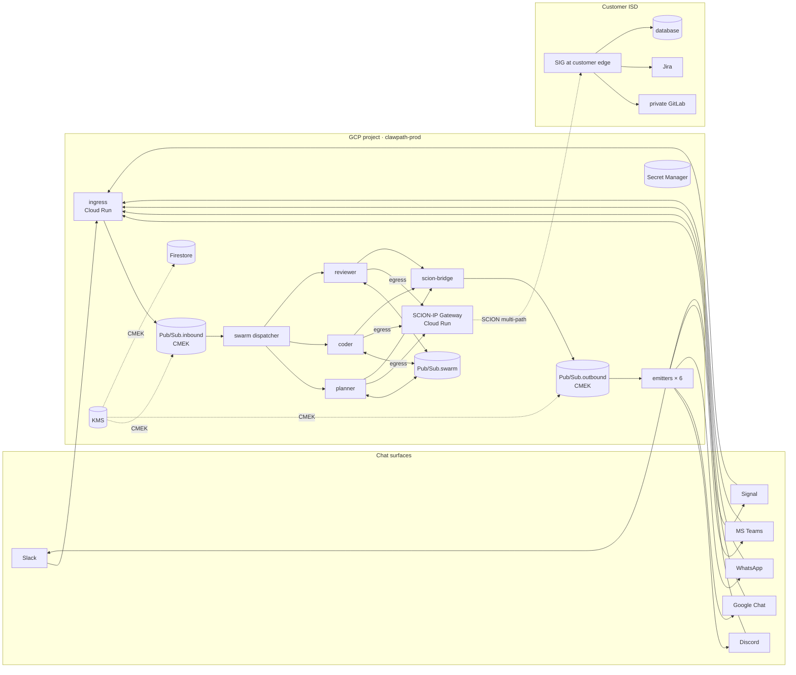

# CLAWPATH

> **C**law + **SCION** path-aware networking + **GCP**.
> An enterprise agentic-swarm fabric where the bus is GCP Pub/Sub, the
> chat surface is `sclawion`, and the wire to customer infrastructure is
> SCION.

> ⚠️ **A note on names.** This repo uses "Scion" two ways. The original
> `sclawion` connectors talk to a Scion-style agent orchestrator (the
> open Claude / Gemini / Codex agent fleet). CLAWPATH adds the *other*
> SCION — the path-aware Internet architecture from ETH Zürich
> ([scion-architecture.net](https://scion-architecture.net),
> [scionproto/scion](https://github.com/scionproto/scion)) — as the
> network underlay so those agents can reach inside customer networks
> without the BGP-and-VPN pain. Both meanings, one acronym; the pun was
> intentional, the deployments aren't.

[](#three-layers)
[](#status)
[](GCP_PATTERNS.md)
[](clawpath/SCION.md)

---

## TL;DR

You already have `sclawion`: chat ↔ agent over Pub/Sub. Beautiful, but it
assumes the agent only ever needs to call public APIs. Real enterprise
work means the agent has to **reach inside the customer's network** —
their git, their ticketing, their database, their CI runner — and do it
under a security regime that survives a CISO review.

CLAWPATH is the answer:

- **Swarm layer.** Many agents per task, coordinated over the Pub/Sub
  bus. Planner, coder, reviewer, deployer — each its own Cloud Run pod,
  each its own GSA.
- **Network layer (the SCION pun).** Agent egress that needs to reach
  customer infrastructure is routed over the SCION protocol via a
  SCION-IP Gateway (SIG). Multi-path, cryptographically authenticated,
  no BGP, sovereign trust roots.
- **Chat layer (the openclaw pun).** All six major chat surfaces — Slack,
  Discord, Google Chat, WhatsApp, Microsoft Teams, Signal — feed the
  swarm through one normalized envelope.

End result: an agent your VP can mention in Slack that goes off,
coordinates a five-agent swarm, opens a PR in your customer's
self-hosted GitLab over a SCION path that doesn't traverse any ISP your
auditor would object to, and reports back in the thread.

---

## Three layers

<!-- paperbanana:figure
prompt: |
  Academic-paper figure, black-on-white, thin 1pt strokes, sans-serif.
  Three horizontal bands stacked top-to-bottom labeled CHAT LAYER,
  SWARM LAYER, NETWORK LAYER. Top band shows six rounded boxes
  Slack, Discord, Google Chat, WhatsApp, Teams, Signal feeding into
  a single rounded box "sclawion ingress". Middle band shows three
  rounded boxes "planner", "coder", "ops" connected by a Pub/Sub bus
  drawn as a thick horizontal line "Pub/Sub envelope sclawion/v1".
  Bottom band shows a SCION-IP Gateway, a SCION cloud (depicted as
  three diverging path lines), and a customer datacenter on the right.
  Annotate each band with its Cloud product in small caps.
output: docs/figures/clawpath-layers.svg
caption: |
  CLAWPATH stacks three layers — chat, swarm, network — and uses the
  Pub/Sub envelope as the single contract between them.
-->


```
┌───────────────────────────────────────────────────────────────────┐
│  CHAT      Slack · Discord · Google Chat · WhatsApp · Teams · Signal │
│            (sclawion connectors — verify, decode, encode)         │
├───────────────────────────────────────────────────────────────────┤
│  SWARM     planner ── coder ── reviewer ── deployer ── monitor    │
│            (Cloud Run pods, coordinated by Pub/Sub envelope)      │
├───────────────────────────────────────────────────────────────────┤
│  NETWORK   SCION-IP Gateway → customer ISD → private services     │
│            (multi-path, no BGP, cryptographic per-hop)            │
└───────────────────────────────────────────────────────────────────┘
       Each layer swappable independently. Schema is the joint.
```

| Layer | What it owns | Why it's separate |
|-------|--------------|-------------------|
| Chat  | Webhook auth, platform shapes, rate limits | Six platforms × one envelope |
| Swarm | Agent lifecycles, role coordination, idempotency | Compute scales differently than I/O |
| Network | Customer reach, sovereignty, path control | Network is the longest-lived contract; treat it as a first-class layer |

## Why this exists

The hard part of putting agents in front of enterprise users is rarely
the model. It's the **integration topology**:

| Problem | Naïve answer | Why it doesn't fly |
|---------|--------------|--------------------|
| Reach customer's private GitLab | Open them up to public Internet | CISO veto |
| Connect via VPN | Shared key, single tunnel | No multi-path, key rotation pain |
| Cloud Interconnect | Carrier circuit + LOA + 4 weeks | Doesn't scale to N customers |
| Public API + bearer | TLS to the rescue | Path is still BGP-attackable; no sovereignty |
| Service mesh extension | Anthos / Tailscale / Cloudflare | Adds yet another control plane |

SCION [^scion-sp2011] [^scion-book] inverts the problem. It's a
path-aware network: the *sender* chooses the path, paths are
cryptographically authenticated per hop [^epic], and the underlying
trust roots are sovereign per **Isolation Domain (ISD)**. Customers
expose their network as their own AS in their own ISD; you peer with
them as a SCION peer; routing is multi-path and no longer trusts BGP
for anything.

### Why SCION (not just any private network) enables this pattern

Three properties are individually nice and collectively *load-bearing*
for an agentic-swarm platform:

1. **Sender-selected, multi-path forwarding.** A swarm running for an
   hour against a customer's GitLab makes hundreds of calls. With
   BGP-routed Internet, any of those can hit a degraded transit
   segment with no in-band signal until TCP times out. With SCION, the
   SIG holds 2–3 paths per destination and switches in <1 s if one
   fails [^scion-book]. The agent never knows.
2. **Per-hop cryptographic authentication.** Each SCION packet carries
   the path as a sequence of MACed hop fields; border routers verify
   at line rate using AS keys derived via DRKey [^drkey]. An off-path
   attacker can't inject a forged response into an agent's
   long-running session — a property TLS alone does not give you,
   because TLS authenticates the *peer* and SCION authenticates the
   *path*. Agents almost always need both.
3. **Sovereign trust per ISD.** The TRC (Trust Root Configuration) of
   each ISD is signed by a quorum of that ISD's core ASes and rotated
   on a schedule the ISD controls [^scion-book]. For a multi-tenant
   agent platform serving regulated customers, this is the difference
   between "we hope BGP didn't lie today" and "we can answer in SQL
   which TRC signed every path our agents used in Q3."

Together these turn a fundamentally adversarial network (the public
Internet) into something the agent can rely on the way a process
relies on a local socket: **a single agent task can fan out across
multiple customer ISDs simultaneously**, with each sub-call traveling
a path the customer approved, all observable in BigQuery, and the bus
on GCP holds the coordination state.

The existence proof that this is not theoretical: SSFN (the Swiss
Secure Finance Network operated by SIX Group) runs on SCION as the
underlay between participating banks, in production for interbank
settlement [^anapaya-ssfn].

Read [`clawpath/SCION.md`](clawpath/SCION.md) for the protocol deep
dive and citations.

## Architecture

<!-- paperbanana:figure
prompt: |
  Academic-paper figure, black-on-white, thin 1pt strokes, sans-serif,
  16:9 landscape. Six chat icons on the far left (Slack, Discord,
  Google Chat, WhatsApp, Teams, Signal) feeding into a vertical lane
  labeled "GCP project: clawpath-prod". Inside that lane, top-to-bottom:
  ingress, Pub/Sub:inbound, swarm dispatcher, three agent pods (planner,
  coder, reviewer) sharing a Pub/Sub:swarm topic, scion-bridge,
  Pub/Sub:outbound, six emitter pods. Right edge of the lane has a SIG
  (SCION-IP Gateway) Cloud Run service. Far right is a SCION cloud
  with three diverging path lines crossing into a customer datacenter
  containing "private GitLab", "Jira", "DB". Annotate every box with its
  GCP product in small caps. CMEK keys shown as small key icons on
  Pub/Sub topics and Firestore.
output: docs/figures/clawpath-arch.svg
caption: |
  CLAWPATH end-to-end: chat in (left), swarm in the middle, customer
  network reached over SCION (right). The Pub/Sub envelope is the
  spine; nothing crosses layers without going through it.
-->




## Six chat surfaces

| Platform     | Auth scheme                          | Notes |
|--------------|--------------------------------------|-------|
| Slack        | HMAC-SHA256 (signing secret)         | Done in `pkg/connectors/slack` |
| Discord      | Ed25519 (interaction signature)      | Done in `pkg/connectors/discord` |
| Google Chat  | RS256 JWT (Google JWKS)              | Done in `pkg/connectors/gchat` |
| WhatsApp     | HMAC-SHA256 (Meta app secret)        | Done in `pkg/connectors/whatsapp` |
| MS Teams     | Bot Framework JWT                    | New: `pkg/connectors/teams` |
| Signal       | Linked-device session via signal-cli | New: `pkg/connectors/signal` (operational caveats apply — see [`clawpath/E2E.md`](clawpath/E2E.md)) |

All six normalize to the same `event.Envelope` (see
[`EVENT_SCHEMA.md`](EVENT_SCHEMA.md)). The router does not know the
difference between a Slack mention and a Signal message; that is the
whole point.

## Enterprise pillars

CLAWPATH is opinionated about what an enterprise reviewer should be
able to check off without negotiation:

1. **Sovereign network paths.** Every agent → customer call travels
   over SCION paths the customer's network team selected. Auditable,
   logged per-request into BigQuery.
2. **Multi-path resilience.** No single ISP outage takes the swarm
   offline. SCION's beaconing gives the SIG a list of paths; the SIG
   picks two and uses the faster.
3. **No BGP attack surface.** Egress to customer infra never crosses
   BGP. There is no path SCION will accept that doesn't trace back to
   the customer's TRC.
4. **No JSON service-account keys.** Already enforced in `sclawion`
   via Workload Identity. CLAWPATH inherits.
5. **CMEK everywhere.** Pub/Sub, Firestore, Artifact Registry. Per-env
   keyring. Customer-controlled keys available per-tenant on request.
6. **Per-customer isolation.** One ISD per customer (recommended) or
   one AS per customer (lighter weight). Either way, blast radius is
   one customer.
7. **Audit by SQL.** Cloud Audit Logs + application logs sinked to
   BigQuery with 400-day retention. SCION path-id and ISD-AS recorded
   on every outbound call.

Detail in [`clawpath/SECURITY.md`](clawpath/SECURITY.md).

## Remote agentic swarms

A "swarm" here means N agents jointly working on one user task,
coordinating exclusively through the Pub/Sub bus (no shared memory, no
RPC between agents). Typical roles:

| Role     | What it does                                       | Reads      | Writes     |
|----------|----------------------------------------------------|------------|------------|
| Planner  | Decomposes user task into sub-tasks                | inbound    | swarm      |
| Coder    | Writes code / API calls inside customer infra      | swarm      | swarm      |
| Reviewer | Critiques outputs of coder before they ship        | swarm      | swarm      |
| Deployer | Runs deploy commands via SCION egress              | swarm      | swarm      |
| Monitor  | Watches for failures, posts back to chat thread    | swarm      | outbound   |

Topologies (linear pipeline, fan-out, mesh, hierarchical) and the
Pub/Sub patterns that implement them are in
[`clawpath/SWARMS.md`](clawpath/SWARMS.md).

## End-to-end demo

Walk through deploying one CLAWPATH instance and talking to it from
all six chat platforms — including the Signal caveats — in
[`clawpath/E2E.md`](clawpath/E2E.md).

## Status

Design + documentation. The `pkg/connectors/teams` and
`pkg/connectors/signal` packages and the SIG Cloud Run service are
in [`ROADMAP.md`](ROADMAP.md) under M5 — Enterprise / SCION.

Until they ship, CLAWPATH is the *target architecture* for sclawion's
enterprise tier; the chat layer (`sclawion`) and the swarm layer
(via the existing `pkg/scion` agent client) are real today.

## Where next

| You want to…                                  | Read |
|-----------------------------------------------|------|
| Understand SCION the protocol, in depth       | [`clawpath/SCION.md`](clawpath/SCION.md) |
| Design or run an agentic swarm                | [`clawpath/SWARMS.md`](clawpath/SWARMS.md) |
| Walk a six-platform end-to-end deploy         | [`clawpath/E2E.md`](clawpath/E2E.md) |
| Pass a CISO review on customer-network reach  | [`clawpath/SECURITY.md`](clawpath/SECURITY.md) |
| See the bus + chat-bridge layer               | [`ARCHITECTURE.md`](ARCHITECTURE.md) |

## References

[^scion-sp2011]: Zhang, X., Hsiao, H.-C., Hasker, G., Chan, H., Perrig, A., & Andersen, D. G. (2011). *SCION: Scalability, Control, and Isolation on Next-Generation Networks*. IEEE Symposium on Security and Privacy (S&P). The original SCION paper.
[^scion-book]: Perrig, A., Szalachowski, P., Reischuk, R. M., & Chuat, L. (2022). *SCION: A Secure Internet Architecture* (2nd ed.). Springer. Free PDF at [scion-architecture.net](https://scion-architecture.net). The canonical reference for the protocol, deployments, and security analysis.
[^epic]: Legner, M., Klenze, T., Wyss, M., Sprenger, C., & Perrig, A. (2020). *EPIC: Every Packet Is Checked in the Data Plane of a Path-Aware Internet*. USENIX Security Symposium.
[^drkey]: Rothenberger, B., Roos, D., Legner, M., & Perrig, A. (2020). *PISKES: Pragmatic Internet-Scale Key-Establishment System*. ACM AsiaCCS. Defines the DRKey hierarchical key derivation used throughout SCION.
[^anapaya-ssfn]: Anapaya Systems / SIX Group. *SCIONet at SIX: The Swiss Secure Finance Network*. Public materials at [anapaya.net](https://anapaya.net). The longest-running SCION production deployment.
