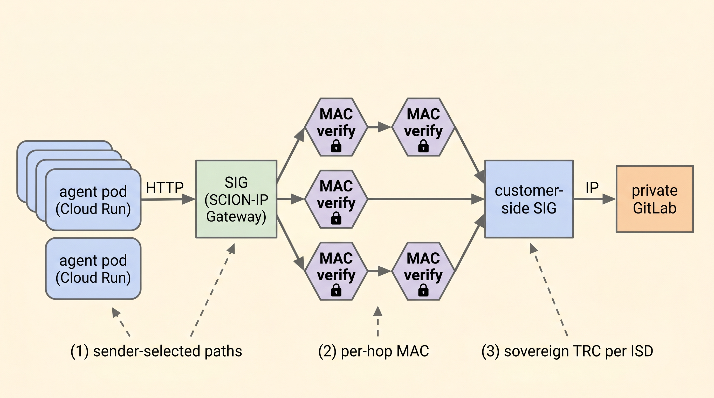

# SCION — what it is and why it matters for agentic systems

> **Sources & freshness.** This document summarizes SCION as understood
> from public materials: the original IEEE S&P paper [^zhang2011], the
> SCION book *SCION: A Secure Internet Architecture* (Springer, 2nd ed.
> 2022) [^perrig2022], the
> [`scionproto/scion`](https://github.com/scionproto/scion) reference
> implementation, and Anapaya's product literature [^anapaya]. Verify
> deployment figures and current production references against
> [scion-architecture.net](https://scion-architecture.net) and
> [anapaya.net](https://anapaya.net) before quoting them in customer
> material — the protocol is still actively evolving.

## What SCION is, in one paragraph

SCION (Scalability, Control, and Isolation On Next-generation Networks)
is a **path-aware Internet architecture**, designed at ETH Zürich
starting in 2009 by Adrian Perrig and collaborators. Where today's
Internet uses BGP to discover a single best-effort path between
networks (and trusts that path implicitly), SCION discovers *all*
viable paths via in-band beaconing, lets the **sender** select which
path a packet takes, and authenticates each hop along the way with a
per-packet cryptographic MAC. Trust is rooted in **Isolation Domains
(ISDs)** — sovereign groupings of Autonomous Systems under a common
**Trust Root Configuration (TRC)** — rather than in a single global
PKI. The result: no BGP hijacks, no route leaks, multi-path by default,
and provable per-hop authentication on every packet.

## Why this is interesting for agentic systems

Most network architecture papers don't bother with agent workloads
because the assumption is "an app is an HTTP client." Agentic swarms
break four of that assumption's premises at once, and SCION happens
to address each:

1. **Long-running tasks span hours.** An agent swarm working on a
   release may make hundreds of calls into a customer's network over
   several hours. The probability that *some* segment of the public
   Internet path degrades during that window is non-trivial. SCION's
   sender-selected multi-path lets the agent's egress switch paths in
   milliseconds without renegotiation [^perrig2022, ch. 5].
2. **Workflows traverse many trust boundaries.** A single user task
   ("ship hotfix to staging") may invoke services in your VPC, your
   customer's VPC, and a third-party SaaS. Today this means a stack of
   VPNs and bearer tokens. With SCION ISDs, each boundary is a
   first-class trust hop with its own TRC and audit trail [^zhang2011].
3. **Off-path attackers have hours to find a window.** Agent sessions
   are long enough to make path-level injection a credible threat.
   EPIC [^epic2020] makes each packet's path commit to a per-packet
   token derived from DRKey, so an attacker that learns one path can't
   replay traffic on it from a different source. TLS doesn't catch
   this; SCION does.
4. **Regulatory requirements increasingly include path provenance.**
   Swiss FINMA, EU GDPR transfer rules, and emerging digital-sovereignty
   regimes all care about which countries traffic transits. SCION makes
   that selectable and provable [^perrig2022, ch. 12]; BGP makes it a
   guess. The SSFN production deployment [^anapaya] is the existence
   proof that this is a story regulated buyers will pay for.

### How SCION enables the CLAWPATH pattern, mechanism by mechanism

| CLAWPATH need | What goes wrong on BGP/Internet | SCION mechanism that fixes it |
|---------------|----------------------------------|--------------------------------|
| Multi-customer fan-out from one swarm | One ISP outage cascades to every customer | ISD isolation — fault in one ISD doesn't affect another |
| Per-call audit of the egress path | `traceroute` is best-effort, mutable | Hop fields signed with AS keys [^perrig2022, ch. 6] |
| Agent runs for an hour without re-auth | TLS protects content, not transit | Per-packet MAC + EPIC [^epic2020] |
| "Did our traffic transit a non-EU AS?" answered in SQL | BGP RIBs are not authoritative for actual transit | Path-id and ISD-AS chain logged per request |
| Failover faster than the LLM notices | TCP retry takes seconds | Sub-second SCION path failover [^perrig2022, ch. 5] |
| Customer-controlled trust roots | Single global PKI; every CA can sign for anyone | TRC quorum per ISD, sovereign rotation [^zhang2011] |

## Core concepts

### Isolation Domain (ISD) and Autonomous System (AS)

- An **AS** is the same concept as in BGP — an organizational network
  unit. SCION ASes have integer identifiers like `64512`.
- An **ISD** is new. It groups one or more ASes under a shared trust
  root. ISDs are sovereign: an ISD's TRC is signed by its core ASes
  and rotated on a schedule the ISD itself controls. Examples: ISD `19`
  is Switzerland's, ISD `26` is Korea's, ISD `64` is the SCIONLab
  global testbed.
- Addresses look like `ISD-AS,IPv6` — e.g.,
  `19-ffaa:1:abcd,fd00::1`. The first 16 bits are the ISD, the next
  48 bits the AS, then a regular IP address inside the AS.

### Trust Root Configuration (TRC)

- A signed file enumerating the core CAs of an ISD.
- Rotated on schedule (typical: 6 months); rotation requires a quorum
  of existing core ASes to sign the new TRC.
- All certificate validation in the ISD chains to the TRC.
- Compromise of one core AS doesn't compromise the ISD: quorum is
  required to issue a new TRC.

### Beaconing — the BGP replacement

- Core ASes periodically send **path-construction beacons (PCBs)**
  through the network.
- Each AS that forwards a PCB appends a **hop entry** signed with its
  AS key.
- Edge ASes collect PCBs and register **path segments** in the **path
  service** of their ISD.
- A host that wants to reach a destination fetches:
  - up-segments (from its AS to its core),
  - core-segments (between cores, possibly across ISDs),
  - down-segments (from destination's core to destination AS),
  and combines them into end-to-end paths. There are typically
  multiple — *that is the point*.

### The hop field — per-packet authentication

- Each packet carries the chosen path as a sequence of **hop fields**,
  each containing a MAC keyed to that hop's AS key.
- Border routers verify the MAC at line rate. A packet on a path the
  sender didn't earn from the path service will not validate.
- This eliminates source-address spoofing across SCION: a packet's
  authenticated path encodes its origin.

### DRKey — symmetric keys without negotiation

- DRKey is a hierarchical key-derivation scheme: any two SCION hosts
  can derive a shared symmetric key from their AS keys without an
  online handshake.
- Latency: a few microseconds. Used by EPIC, COLIBRI, and source
  authentication.
- This is the killer feature for path validation at line rate.

### EPIC — per-packet path validation

- An add-on that uses DRKey to make each packet's path commit to a
  per-packet token.
- A path issued to one source can't be replayed by another.
- Defense against advanced source-spoofing attacks.

### COLIBRI / Hummingbird — bandwidth reservations

- SCION supports inter-domain bandwidth reservations. A path can carry
  a guarantee like "100 Mbps from ISD 19 to ISD 26 for the next hour."
- Useful for: cross-region replication, scheduled batch transfers,
  agentic swarms with predictable peak demand.

### SIG — SCION-IP Gateway

- A Linux daemon (or container) that encapsulates regular IP packets
  into SCION at one end and decapsulates at the other.
- Lets unmodified IP applications use SCION as a tunnel.
- This is **the** integration pattern for cloud workloads: deploy a
  SIG on Cloud Run / GKE on the GCP side, deploy a SIG at the
  customer's edge, your applications speak normal IP.

## Production deployments worth knowing

| Deployment | Operator | What it does |
|------------|----------|--------------|
| **SSFN** (Swiss Secure Finance Network) | SIX Group | The Swiss interbank settlement network. SCION is the underlay between participating banks. Used in production since the late 2010s. The canonical "SCION at scale in regulated finance" reference. |
| **Anapaya** | Anapaya Systems (ETH spinoff) | Commercial provider of SCION services and hardware. Operates a backbone that participating ISPs and enterprises peer into. |
| **SCIONLab** | ETH Zürich + community | Global research testbed; free accounts. The way most teams first run SCION code. |
| **SCI-ED** | Swiss universities | Research-and-education SCION network. |
| **National-government deployments** | Various | A handful of European national governments operate sovereign ISDs for inter-agency traffic. Specifics vary; verify before quoting customers. |

The clearest external evidence base: the **2017 Springer book**, the
ongoing **scionproto** reference implementation in Go, and Anapaya's
case studies. The ETH research group has published extensively in
SIGCOMM / NDSS / USENIX Security through the 2010s — those papers are
where the formal security proofs live.

## How CLAWPATH uses SCION

<!-- paperbanana:figure
prompt: |
  Academic-paper figure, black-on-white, thin 1pt strokes, sans-serif,
  16:9 landscape. Left side: a stack of three small rounded boxes
  labeled "agent pod (Cloud Run)" with an HTTP arrow leaving the top.
  Center: a SIG (SCION-IP Gateway) box that takes the IP traffic and
  emits SCION packets — show three diverging arrows representing
  multi-path. Each arrow passes through one or two AS-shaped hexagons
  with a small lock icon labeled "MAC verify". The arrows converge on
  the right at a customer-side SIG, which decapsulates to a final IP
  arrow into a "private GitLab" box. At the bottom of the figure,
  three small annotation arrows label: "(1) sender-selected paths",
  "(2) per-hop MAC", "(3) sovereign TRC per ISD".
caption: |
  CLAWPATH treats SCION as a network underlay. Agents speak unmodified
  HTTP; the SIG fans the same call across multiple
  cryptographically-authenticated paths into the customer's network.
output: ../figures/clawpath-scion-dataflow.png
-->


The integration is deliberately small-surface: SCION is treated as
**network underlay only**, not as an application protocol. Agents
continue to make ordinary HTTP/gRPC calls; the SIG handles
encapsulation transparently.

```
agent pod (Cloud Run)
   │  HTTP request to https://gitlab.customer.internal/api/...
   ▼
egress NAT to SIG endpoint
   │
SIG (Cloud Run, hostNetwork-equivalent via gVisor or GKE)
   │  encapsulates as SCION packets
   │  selects 2 paths from path service (multi-path)
   ▼
SCION network
   │  per-hop MAC verified at each border router
   ▼
SIG at customer edge (their VM in their VPC)
   │  decapsulates back to IP
   ▼
gitlab.customer.internal
```

### Components on the GCP side

- **SCION dispatcher + control service** as a Cloud Run service
  (a small Go binary; the reference implementation is already in Go,
  which keeps the deployment shape consistent with the rest of
  CLAWPATH).
- **SIG** as a separate Cloud Run service. Outbound NAT from agent
  pods directs traffic destined for customer ISDs through the SIG.
- **Path policy service** (small Go service): enforces per-tenant
  rules like "this customer's traffic may transit only ISDs 19 and 26."

### Components on the customer side

The customer runs:

- A **SIG** at their edge (a Linux VM is enough).
- A **child AS** in their preferred ISD. They can join an existing ISD
  (Anapaya / SCIONLab / their national ISD) or stand up their own.
- Routing rules so that traffic destined for our SIG's ISD-AS goes via
  SCION rather than the public Internet.

Setup is a one-time exercise per customer, comparable in effort to a
site-to-site IPsec but without the operational drawbacks of ongoing
key rotation and single-tunnel availability.

### What we do *not* do

- Run our own ISD by default. Use Anapaya or join a customer-preferred
  ISD; running an ISD is a multi-quarter compliance project.
- Modify agent code to be SCION-aware. The whole point of the SIG is
  that the agent calls `https://gitlab.customer.internal` and never
  knows the difference.
- Replace TLS with SCION's path crypto. Use both. SCION authenticates
  the *path*; TLS authenticates the *peer*. They protect different
  things.

## Threat model coverage delta

Compared to the baseline `sclawion` security posture in
[`../SECURITY.md`](../SECURITY.md), SCION as the egress path adds:

| Threat                                  | Baseline mitigation     | CLAWPATH-with-SCION addition |
|-----------------------------------------|--------------------------|-------------------------------|
| BGP hijack against agent egress         | None — accepted risk     | Eliminated (no BGP in path)   |
| Single-ISP outage                       | None — accepted risk     | Multi-path failover (<1 s)    |
| Path-injection (off-path)               | TLS only                 | Cryptographic per-hop MAC     |
| Egress traffic transits hostile ASN     | Untracked                | Path policy enforces transit set |
| Customer can't audit what we did inside their net | Cloud Audit Logs (our side) | Path-id + ISD-AS logged per request |

## Reading list

If you take only one source: the SCION book —
*SCION: A Secure Internet Architecture* (Perrig, Szalachowski, Reischuk
& Chuat, Springer, 2nd ed. 2022) [^perrig2022]. Free PDF on
scion-architecture.net.

After that:

- **The original paper** [^zhang2011] for the design rationale.
- **The reference implementation:** [`scionproto/scion`](https://github.com/scionproto/scion) — Go code that runs SCIONLab and most production deployments.
- **Anapaya's docs** [^anapaya] for practical deployment patterns; what they sell is what enterprises actually pay for.
- **EPIC** [^epic2020] and **PISKES/DRKey** [^drkey2020] for the cryptographic deep dives.
- **COLIBRI / Hummingbird** [^hummingbird] for inter-domain bandwidth reservations.

## References

[^zhang2011]: Zhang, X., Hsiao, H.-C., Hasker, G., Chan, H., Perrig, A., & Andersen, D. G. (2011). *SCION: Scalability, Control, and Isolation on Next-Generation Networks*. IEEE Symposium on Security and Privacy (S&P). The first SCION paper; the design rationale lives here.
[^perrig2022]: Perrig, A., Szalachowski, P., Reischuk, R. M., & Chuat, L. (2022). *SCION: A Secure Internet Architecture* (2nd ed.). Springer. ISBN 978-3-031-04504-2. Free PDF at [scion-architecture.net](https://scion-architecture.net). The protocol bible — beaconing, path service, hop fields, TRC, deployments.
[^epic2020]: Legner, M., Klenze, T., Wyss, M., Sprenger, C., & Perrig, A. (2020). *EPIC: Every Packet Is Checked in the Data Plane of a Path-Aware Internet*. USENIX Security Symposium. The per-packet path validation extension.
[^drkey2020]: Rothenberger, B., Roos, D., Legner, M., & Perrig, A. (2020). *PISKES: Pragmatic Internet-Scale Key-Establishment System*. ACM AsiaCCS. Defines DRKey, the hierarchical key derivation that makes per-packet MACs feasible at line rate.
[^hummingbird]: Wyss, M., Giacomello, M., Legner, M., & Perrig, A. (2024). *Hummingbird: Fast, Flexible, and Secure Inter-Domain Bandwidth Reservations*. The COLIBRI successor for inter-domain QoS.
[^anapaya]: Anapaya Systems (ETH Zürich spinoff). *SCIONet at SIX Group: The Swiss Secure Finance Network*. Public materials at [anapaya.net](https://anapaya.net). The longest-running SCION production deployment, in regulated finance.

## Open questions (to resolve before first customer deploy)

1. **Which ISD to join by default.** Anapaya's commercial ISD is the
   easiest; a national ISD is best for regulated customers; SCIONLab is
   for development only.
2. **SIG deployment shape on Cloud Run.** Cloud Run's container
   networking model is more constrained than GKE — a serverless VPC
   connector + SIG sidecar is the leading candidate; GKE Autopilot is
   the fallback if Cloud Run's networking proves insufficient.
3. **Path-policy granularity.** Per-tenant is the right default; finer
   (per-task, per-conversation) is possible but adds latency.
4. **DRKey distribution at the GCP edge.** The reference dispatcher
   handles this; we'd need to verify it works in Cloud Run's
   environment.
5. **Failover behavior when SCION is unavailable.** Default: hard fail
   with a clear error in the agent's chat reply ("can't reach customer
   network — SCION path unavailable"). Alternative: fall back to a
   pre-approved IPsec tunnel. Customer choice.
