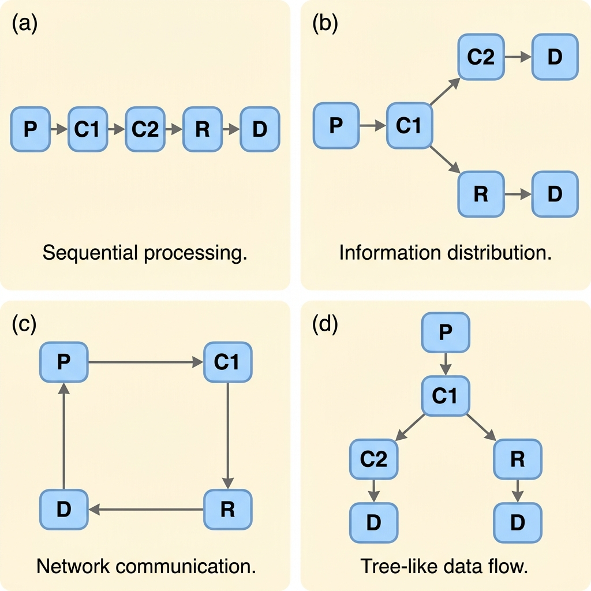
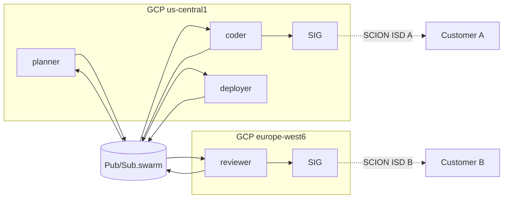

# Remote agentic swarms

A "swarm" in CLAWPATH is N agents collaborating on one user task,
coordinating exclusively through the Pub/Sub bus. There is **no shared
memory, no direct RPC between agents**. The bus is the only sync
primitive; this is a deliberate constraint that buys idempotency,
audit, and replay for free.

## Anatomy of a swarm

Roles, not agent identities. The same Cloud Run image plays whichever
role its `--role` flag selects; multiple replicas of the same role
compete for work via Pub/Sub.

| Role     | Reads                          | Writes                         | Typical model        |
|----------|--------------------------------|--------------------------------|----------------------|
| Planner  | `inbound`                      | `swarm.tasks`                  | Claude / Gemini Pro  |
| Coder    | `swarm.tasks` (filter=role:coder) | `swarm.results`             | Claude Code / Gemini CLI |
| Reviewer | `swarm.results`                | `swarm.tasks` (re-work) or `swarm.approved` | Claude / Gemini |
| Deployer | `swarm.approved`               | `swarm.deployments`            | Claude Code w/ shell access |
| Monitor  | `swarm.*`                      | `outbound`                     | Lightweight LLM or rules |

The roster is configurable per-swarm: a "code review only" swarm might
be planner + reviewer; a "full release" swarm might be all five.

## Topologies

<!-- paperbanana:figure
prompt: |
  Academic-paper figure, black-on-white, thin 1pt strokes, sans-serif.
  Four panels labeled (a) PIPELINE, (b) FAN-OUT, (c) MESH,
  (d) HIERARCHICAL, each showing 4-6 small rounded boxes labeled
  P, C1, C2, R, D connected by directed arrows representing the
  Pub/Sub topic flow. Below each panel a one-line caption listing
  use cases.
output: docs/figures/clawpath-swarm-topologies.png
caption: |
  Four common swarm topologies. The Pub/Sub bus implements all of them
  with the same primitives — only the topic filters and subscription
  fan-out change.
-->


### Pipeline (planner → coder → reviewer → deployer)

The simplest swarm. Each role subscribes to the previous role's output
topic. One message per stage. Use when steps are strictly sequential
(e.g., generate → test → deploy).

```
inbound ─▶ planner ─▶ tasks ─▶ coder ─▶ results ─▶ reviewer ─▶ approved ─▶ deployer
                                                                            │
                                                                            ▼
                                                                         outbound
```

### Fan-out (one planner, N coders)

Planner emits N independent sub-tasks; multiple coder replicas pick
them up in parallel via competing Pub/Sub subscribers. Reviewer
aggregates. Use when the user task is decomposable
("refactor these 12 files in parallel").

### Mesh (peer agents talk to each other)

Every agent subscribes to a shared `swarm.bus` topic with role-based
attribute filters. Used for deliberation: planner posts a draft, two
reviewers comment, planner revises. Higher token cost; better quality
on ambiguous tasks.

### Hierarchical (lead planner spawns sub-planners)

Lead planner emits "spawn-subswarm" events on a meta-topic; an
orchestrator service materializes a child swarm with its own topic
namespace. Used for very large tasks that need their own sub-budget
and isolation. Adds operational complexity — start with a flat
topology unless you have a concrete need.

## Coordination primitives

### Idempotent task acceptance

Every task message carries a `task_id` (ULID). When a coder picks one
up, it does:

```go
firstSeen, err := correlation.MarkProcessed(ctx, "task:"+taskID)
if !firstSeen {
    return nil // duplicate Pub/Sub delivery; ack and move on
}
```

This is the same Firestore CreateIfMissing pattern from the base
sclawion router. Pub/Sub's at-least-once delivery becomes
effectively-once at the application layer.

### Leader election (when you need it)

Pipeline and fan-out don't need it. Mesh and hierarchical sometimes do
(e.g., "exactly one reviewer should declare consensus"). Use Firestore:

```go
ref := fs.Collection("swarm_leaders").Doc(swarmID + ":consensus")
_, err := ref.Create(ctx, map[string]any{
    "agent_id": myAgentID,
    "expires":  time.Now().Add(60 * time.Second),
})
if status.Code(err) == codes.AlreadyExists {
    return // someone else is leader
}
// I am leader for the next 60s; refresh or release before expiry
```

The TTL is the safety net — if the leader crashes, the lease expires
and another agent takes it.

### Budget enforcement

Each swarm carries a budget envelope (max tokens, max wall-clock, max
deploy actions). The dispatcher attaches it to the planner's first
event:

```json
{
  "swarm_id": "01HQXYZ...",
  "budget": {
    "max_tokens":    500000,
    "max_wallclock": "PT30M",
    "max_deploys":   3
  }
}
```

Each agent decrements its consumption back to a Firestore counter
(`swarm_budgets/{swarm_id}`) before each major action; if the counter
underflows, the agent emits `swarm.budget_exhausted` and the monitor
posts a chat message asking the user to extend or abort.

### Backpressure

If `swarm.tasks` queue depth exceeds threshold, the dispatcher refuses
new user messages with a friendly "swarm at capacity, try again in a
minute" reply rather than queueing forever. Cloud Monitoring alert at
50% of the threshold gives you time to scale or to investigate stuck
agents.

## Cross-VPC and cross-customer swarms

This is where SCION earns its keep.

A swarm working on a multi-customer integration may have:

- Planner running in our GCP project (no customer access needed).
- Coder running in our GCP project (uses customer-A's GitLab via
  SCION ISD A).
- Reviewer running in customer-B's preferred region (subject to data
  residency); reviewer's egress to *its* customer goes via SCION ISD B.
- Deployer running in our project, deploys to customer-A only.

Each agent's egress policy is set per-pod via labels; the SIG enforces
"this pod's traffic to ISD-A is allowed; to ISD-B is not." The bus is
shared (single Pub/Sub project) — the **content** is decoupled by
`swarm_id` and per-message attribute filters.



## Failure modes

| Failure | Effect | Mitigation |
|---------|--------|------------|
| Coder crashes mid-task | Message redelivers after ack-deadline | Idempotent task; another coder picks up |
| Two coders pick up same task | Both work, both write results | First write wins via `MarkProcessed`; loser drops its result with audit log |
| Reviewer disagrees forever | Loop between coder and reviewer | Budget enforcement caps the loop |
| User edits original message | New `user.message` event arrives | Planner detects via `conversation_id` and either supersedes or branches |
| Network partition: SCION path to customer drops | Deployer's call fails | Multi-path SCION retries; if all paths down, deployer emits `swarm.blocked` and posts to chat |
| Agent emits malformed event | Bridge drops the line | Bridge logs + drops; never crash on bad agent output |
| Pub/Sub topic backed up | Backpressure kicks in | Dispatcher refuses new tasks; alert pages on-call |

## Observability

Every event in a swarm carries:

- `swarm_id` — joins all events for one user task
- `task_id` — joins planner's split into coder's pick-up
- `parent_task_id` — for hierarchical swarms
- OTEL `trace_id` propagated end-to-end

In Cloud Trace, one user message becomes a single span tree:

```
ingress.handle (Slack)
└── router.dispatch
    └── planner.plan
        ├── coder.refactor (file_a.go)
        ├── coder.refactor (file_b.go)
        ├── reviewer.review
        │   └── reviewer.approve
        └── deployer.deploy
            └── sig.scion_egress  ← SCION path-id and ISD-AS recorded as span attributes
```

Cost telemetry per swarm: tokens spent, wall-clock, number of egress
calls per ISD-AS, written to BigQuery for SQL analysis.

## What to *not* build into swarms

- **Synchronous RPC between agents.** If you find yourself wanting it,
  you've made the swarm too tightly coupled. Use the bus.
- **In-process state sharing across roles.** Roles are different
  processes. Communicate over the bus.
- **Agent-side rate limiting.** Use Pub/Sub flow control + Firestore
  counters; don't trust agents to throttle themselves.
- **Agent-to-agent crypto.** Trust comes from the bus's OIDC + CMEK,
  not from agents authenticating each other.
- **More than 5 roles in a flat topology.** If you need more, you need
  hierarchical — flat at scale becomes impossible to reason about.

## Where this fits in the existing repo

The base `sclawion` project has a single placeholder agent
(`pkg/scion`). To enable swarms, the additions are:

- New `cmd/swarm-dispatcher/` Cloud Run service.
- Extended `pkg/event` with `swarm.*` event kinds.
- New `pkg/swarm/` package with role registry, budget enforcement,
  topology helpers.
- New Pub/Sub topics: `swarm.tasks`, `swarm.results`, `swarm.approved`,
  `swarm.deployments`.

Roadmap milestone M5 (Enterprise / SCION) covers all of the above.
